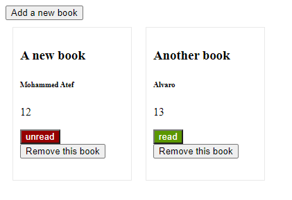

# The Library -js

This project is a library project where you can add and remove books using javascript.

In this project we:

- Added a form to enter the books' data.
- Added some simple styles for the view.
- Showed the list of the books.

## Usage

- Clone the repo "https://github.com/Mohamed-js/Library.git".
- Open the page.
- Start adding books.

## Technologies

- JavaScript
- CSS
- HTML
- VSCode

## Authors

👤 **Alvaro Ruiz**

- Github: [@alvarorf](https://github.com/alvarorf)
- Twitter: [@aaruizf](https://twitter.com/aaruizf)
- Linkedin: [linkedin](https://www.linkedin.com/in/alvaro-andr%C3%A9s-ruiz-florez/)

👤 **Mohammed Atef**

- GitHub: [@Mohamed-Atef](https://github.com/Mohamed-js)
- Twitter: [@Mohammed_Atef](https://twitter.com/Demovejetta)
- LinkedIn: [LinkedIn](https://www.linkedin.com/in/mohamed-js/)

## 🤝 Contributing

Contributions, issues, and feature requests are welcome!

## Show your support

Give a ⭐️ if you like this project!

### Acknowledgements

- Microverse
- The Odin Project
